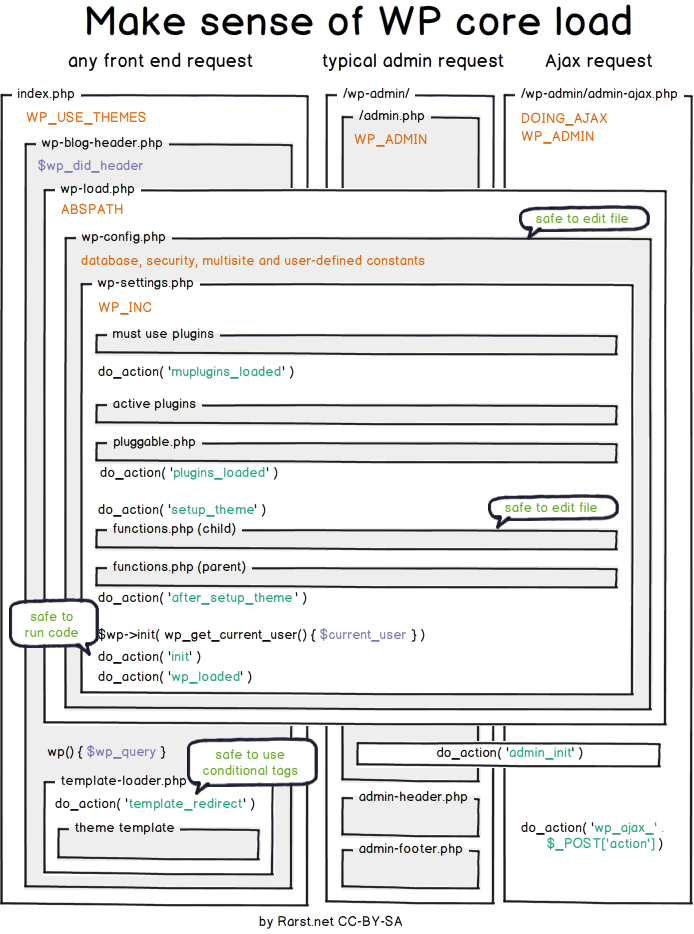

# コア

WordPressコアとは、WordPress自身を動かしているコードのことです。wordpress.orgからWordPressをダウンロードすると取得できるものからテーマとプラグインを取り除いた分になります。

## 読み込みプロセス

todo: コアの読み込みプロセスに関するメモとRarstsのブログ記事への参照

## jQueryの登録解除

コアに同梱されているjQueryの登録を解除して自分のコピーやGoogle CDNのものを追加しようとするプラグインやテーマの開発者がたくさんいますが、互換性の問題を引き起こす可能性があるので、それはやめましょう。

その代わり、WordPressに同梱されているjQueryのコピーを使い、テスト時には最新のWordPressで使われているバージョンを目標にしましょう。これにより、プラグイン間の互換性を最大化します。

## コアファイルの変更

何かを追加したり取り除いたりするためにコアの一部を修正したい誘惑に駆られるかもしれませんが、それは絶対にダメです。WordPressがアップデートされるとその変更はすべて失われます。

その代わり、フック/アクションとフィルターを使ってコアの挙動を変更しましょう。

## .orgでのコアの開発作業

 - trunk
 - develop
 - grunt builds develop into trunk
 - Trac
 - code freeze
 - release
