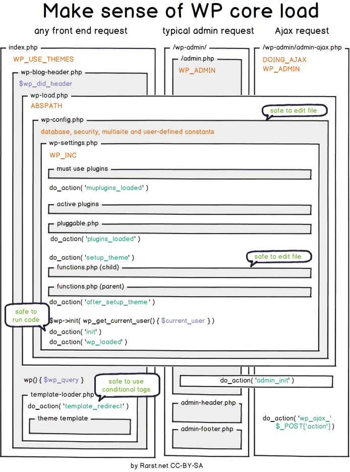

# Core

O `Core` do WordPress é o código que faz com ele funcione. São os primeiros arquivos que você tem logo após fazer o `download` do site oficial, exceto os temas e os plugins.

## Carregamento de Processos

De maneira simples, o `core` do WordPress segue o seguinte padrão de processos:

 - MU Plugins ou Must-Use Plugins
 - Plugins Ativados
 - Carrega as funções do Tema (functions.php)
 - Roda o hook inicial
 - Carrega a main query
 - Carrega o template

Administração e requisições AJAX segue um processo similar porém mais leve. O diagrama abaixo aborda este processo com mais detalhes:

## jQuery

Muitos desenvolvedores de plugins e temas preferem remover o jQuery que vem por padrão com o WordPress, e acabam por adicionar sua própria versão do mesmo, normalmente é o jQuery do Google CDN. Não faça isso! Caso contrário poderá causar problemas de compatibilidade. Use a versão do jQuery que vem junto com o WordPress. Isso garante maior compatibilidade dentre os plugins.

## Modificando o Core

É tentador modificar partes do `Core`, removendo ou adicionando funcionalidades, mas isso NUNCA deve ser feito. Quando você realizar a atualização do WordPress, todas as suas modificações serão perdidas. Ao invés de mudar o `Core`, use os famosos `Hooks, Actions e Filters` para modificar as funcionalidades da sua aplicação.

## Mais Informações

 - [Entendo o carregamento do Core](http://www.rarst.net/wordpress/wordpress-core-load/)
